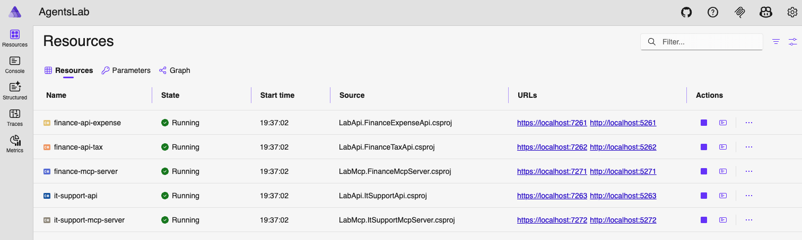

# AgentsLab, Microsoft Agent Framework demos

A set of C# .NET Microsoft Agent Framework demos set to run mostly locally with Ollama.

I'm experimenting with agents and AI with C#, check a few demos and ideas here.

## Features

- Ollama, a local LLM server
- GitHub Copilot agents (optional for a few demos)
- Azure CosmosDB (optional for a few demos)
- Streaming, reasoning, thinking, tools, and more
- Agent memory and AI context providers
- Multi-modal demo
- Multi-agents demo with workflows and orchestration
- MCP (Model Context Protocol)
- Aspire to coordinate the MCP servers and REST APIs

Console menu, example:

```
Labs:                              Tags:
1 - TokensStreamerAgent            Streaming, Tokens
2 - ReasoningThinkingAgent         Streaming, Tokens, Thinking
3 - SentimentAnalyserChat          SentimentAnalyser, Chat
4 - SentimentAnalyserAgent         SentimentAnalyser, DataExtraction
5 - ImageDataExtractionAgent       MultiModal, Vision, DataExtraction
6 - MeetingNoSession
7 - MeetingHistoryInMemory         Conversation, ChatHistory
8 - MeetingHistoryCosmosDb         Conversation, ChatHistory, Azure, CosmosDb
9 - MeetingHistoryCosmosDbCont     Conversation, ChatHistory, Azure, CosmosDb
10 - TravelAdvisorAgent            Conversation, ChatHistory, Tools
11 - UserPreferencesAiContext      Conversation, ChatHistory, AiContextProvider, UserInteraction
12 - ConversationCompaction        Conversation, ChatHistory, Azure, CosmosDb, Compaction
13 - WriterAgent                   Tools
14 - WorkflowWritingAgency         Tools, MultiAgent, Workflow
15 - McpSubmitExpenseAgent         Conversation, ChatHistory, Tools, Mcp
16 - McpServicesAgent              Conversation, ChatHistory, Tools, Mcp, UserInteraction
17 - McpServicesAgency             Conversation, ChatHistory, Tools, Mcp, MultiAgent, UserInteraction
Type a lab number or x to exit:
```

The Aspire resources, example:


## Prerequisites

- .NET 10 SDK

- [Ollama](https://ollama.com/download)

- Pull the models so that Ollama has them locally:

  ```Sh
  ollama pull llama3.2
  ollama pull llama3.2-vision
  ollama pull qwen3.5:4b
  ollama pull qwen3-vl:4b
  ollama pull qwen3-vl:8b
  ```

### Prerequisites for GitHub Copilot (Optional)

If you like to run the Labs that depend on GitHub Copilot agents.

- set a GitHub Personal Access Token (PAT) with `models` scope: https://github.com/settings/tokens

  Save the PAT in an environment variable (`~/.zprofile`):

  ```Sh
  export GITHUB_TOKEN="YOUR-GITHUB-PAT"
  ```

### Prerequisites for Azure (Optional)

If you like to run the Labs that depend on Azure (like using the Azure CosmosBD).

- [Azure account](https://portal.azure.com/)

- [azd](https://learn.microsoft.com/en-us/azure/developer/azure-developer-cli/install-azd)

## Provisioning the Azure Infrastructure

```Sh
# preview what to provision on Azure (check subscription, location and resource group)
cd AgentsLab/src

azd provision --preview
```

```Sh
# provision the infrastructure on Azure
cd AgentsLab/src

azd provision
```

```Sh
# remove from Azure once you are done
cd AgentsLab/src

azd down
```

#### Update the Azure CosmosDb instance

Create the database: `agentsdb` and the container: `history`.

Partition keys for the container: `/tenantId` -> `/userId` -> `/conversationId`

## Running the AgentsLab projects

```Sh
# clone the repo

cd AgentsLab/src

# run on each terminal or start both projects in an IDE

dotnet run --project AgentsLab.AppHost # start all needed web APIs and MCP servers (optional, not needed for all labs)

dotnet run --project AgentsLab.AppConsole # start the console app that host the agents and chats
```

## References

https://github.com/microsoft/agent-framework/

https://devblogs.microsoft.com/dotnet/introducing-microsoft-agent-framework-preview/

https://www.youtube.com/watch?v=wIUkjYJlEnU
